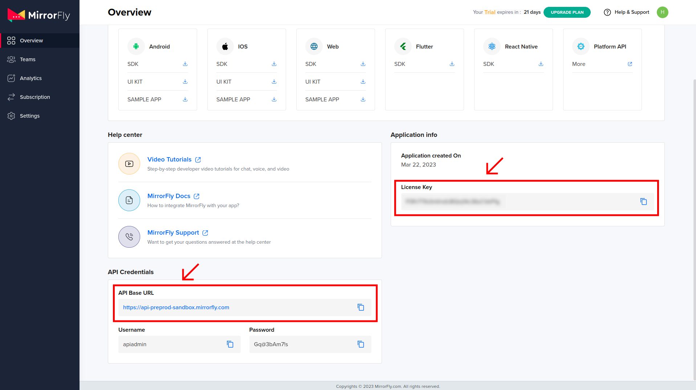

# [Mirrofly](https://www.mirrorfly.com) Plugin for Flutter

[](https://flutter.dev/)
[](https://dart.dev/)

## Table of contents

1. [Introduction](#Introduction)
1. [Requirements](#requirements)
1. [Getting started](#getting-started)
1. [Sending your first message](#sending-your-first-message)
1. [Getting help](#getting-help)

<br />

## Introduction

Through Mirrorfly Plugin for flutter, you can efficiently integrate real-time chat into your client app. On the client-side implementation, you can initialize, configure and build the chat with minimal effort. On the server-side, Mirrorfly ensures reliable infra-management services for your chat within the app. This **readme** provides essential information on the Mirrorfly Plugin’s structure, supplementary features, and the installation steps.

## Requirements

The minimum requirements for Mirrorfly Plugin for Flutter are:

- Xcode or Android studio
- Dart 2.19.1 or above
- Flutter 2.0.0 or higher

## Getting started

This section gives you information you need to get started with Mirrorfly Plugin for Flutter. Follow the simple steps below to build the Mirrorfly Plugin into your client app.

### Try the sample app

The fastest way to test Mirrorfly Plugin for Flutter is to build your chat app on top of our sample app. To create a project for the sample app, download the app from our GitHub repository. The link is down below.

- https://github.com/MirrorFly/MirrorFly-Flutter-Sample

### Step 1: Let's integrate Plugin for Flutter

Make an easy and efficient way with CONTUS TECH MirrorFly Plugin for Flutter - simply integrate the real-time chat features and functionalities into a client's app.

With client-side implementation, our Mirrorfly Plugin lets you initialize and configure the chat easily. With the server-side, Our solution ensures the most reliable infra-management services for the chat within the app. Furthermore, we will let you know how to install the chat Plugin in your app for a better in-app chat experience.

### Plugin License Key
Follow the below steps to get your license key:

1. Sign up into [MirrorFly Console page](https://console.mirrorfly.com/register) for free MirrorFly account, If you already have a MirrorFly account, sign into your account
2. Once you’re in! You get access to your MirrorFly account ‘Overview page’ where you can find a license key for further integration process
3. Copy the license key from the ‘Application info’ section



5. Add the following to your root `build.gradle` file in your Android folder.

```gradle
   allprojects {
    repositories {
        google()
        mavenCentral()
        jcenter()
        maven {
            url "https://repo.mirrorfly.com/snapshot/"
        }
    }
  }
```

### Step 2: Install packages

Installing the Mirrorfly Plugin is a simple process if you’re familiar with using external packages or Plugin’s in your projects. Follow the steps below via `pub`.

- Add following dependency in `pubspec.yaml`.

```yaml
dependencies:
  mirrorfly_Plugin: ^2.0.0
```

- Run `flutter pub get` command in your project directory.

### Step 3: Use the Mirrorfly Plugin in Flutter

You can use all classes and methods just with the one import statement as shown below.

```dart
import 'package:mirrorfly_plugin/mirrorfly.dart';
```

## Sending your first message

Follow the step-by-step instructions below to authenticate and send your first message.

### Authentication

In order to use the features of Mirrorfly Plugin for Flutter, you should initiate the `MirrorflyPlugin` instance through user authentication with Mirrorfly server. This instance communicates and interacts with the server based on an authenticated user account, allowing the client app to use the Chat Plugin's features.

Here are the steps to sending your first message using the Mirrorfly Plugin:

### Step 1: Initialize the Mirrorfly Plugin

To initialize the plugin, place the below code in your `main.dart` file `main` function on before `runApp()`.

```dart
 void main() {
  WidgetsFlutterBinding.ensureInitialized();
  Mirrorfly.init(
      baseUrl: 'https://api-preprod-sandbox.mirrorfly.com/api/v1/',
      licenseKey: 'your license key',
      iOSContainerID: 'your app group id');
  runApp(const MyApp());
}
```

### Step 2: Registration

he below method to register a user in sandbox Live mode.

> **Info** Unless you log out the session, make a note that should never call the registration method more than once in an application

> **Note**: While registration, the below `registerUser` method will accept the `FCM_TOKEN` as an optional param and pass it across. `The connection will be established automatically upon completion of registration and not required for seperate login`.

```dart
Mirrorfly.registerUser(userIdentifier).then((value) {
    if (value.contains("data")) {
      var userData = registerModelFromJson(value);
    // Get Username and password from the object
    }
}).catchError((error) {
    // Register user failed print throwable to find the exception details.
    debugPrint(error.message);
});
```
| Argument | Type | Description |
| --- | --- | --- |
| userIdentifier | `String` | A unique Id to Register the User |
| token | `String` | A registration token that is generated by FCM Plugin for the user's app instance to send message for free |

### Terminology

Some of the most common terminologies used in Mirrorfly Plugin with description

| keyword | Explanation |
| --- | --- |
| userID/userBareID | Unique ID assigned for each user Ex: 12345678 (any alphanumeric). The below characters is not allowed in userId: U+0022 (") U+0026 (&) U+0027 (') U+002F (/) U+003A (:) U+003C (<) U+003E (>) U+0040 (@) userID should follow below specification: https://xmpp.org/extensions/xep-0106.html |
| userJid (or) JID | userID+@+domain of the chat server Ex. 12345678@xmpp.chatsystem.dev.contus.us |
| groupID/groupBareID | Unique ID assigned for each group Ex: group123456 (any alphanumeric). GroupJID = groupID +@mix.+domain of the chat server Ex: group123456@mix.xmpp.mirrorfly.dev.contus.us` |

> **Info** Plugin will have built-in functions to prepare the JID, Group JID, and more.

## Send a One-to-One Message

Use the below method to send a text message to other user,

> **Note**: To generate a unique user jid by `username`, you must call the below method

```dart
var userJid = await Mirrorfly.getJid(username);
```

```dart
Mirrorfly.sendTextMessage(message, jid, replyMessageId).then((value) {
  // you will get the message sent success response
  var chatMessage = sendMessageModelFromJson(value);
});
```

| Argument         | Type   | Description                                      |
| ---------------- | ------ | ------------------------------------------------ |
| jid           | String | JID of the end user                              |
| message       | String | Indicates the text message that needs to be sent |
| replyMessageId | String | Specifies the Message ID of replied message      |

## Receive a One-to-One Message

Here the listeners would be called only when a new message is received from other user. To get more details please visit this [callback listeners](https://www.mirrorfly.com/docs/chat/flutter_plugin/callback-listeners)

```dart
Mirrorfly.onMessageReceived.listen(result){
vat chatMessage = sendMessageModelFromJson(result)
}
```

## Getting Help

Check out the Official Mirrorfly [Flutter docs](https://www.mirrorfly.com/docs/chat/flutter_plugin/quick-start)

<br />